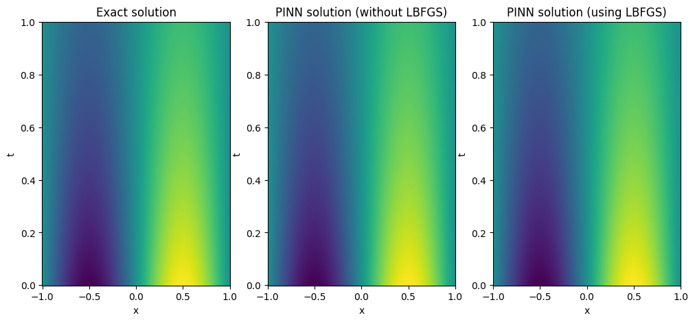
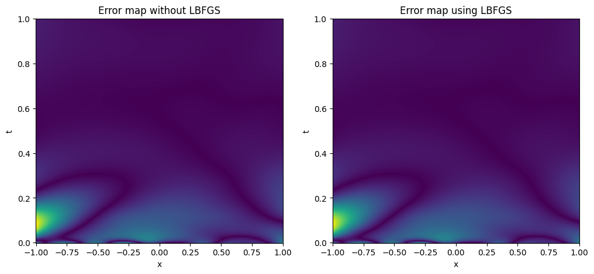
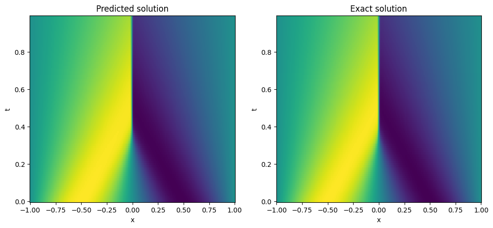
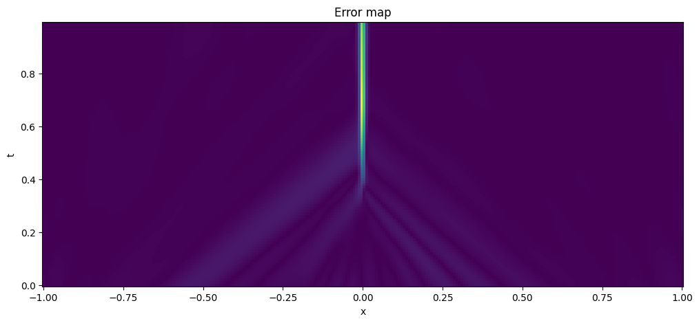
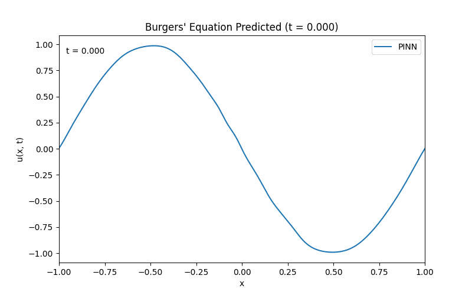
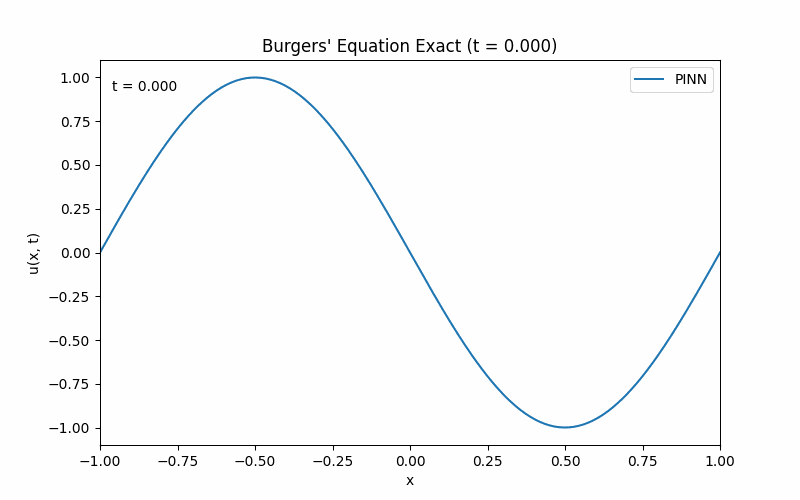

# Physics-Informed Neural Networks (PINNs)

A PyTorch implementation of a Physics-Informed Neural Network for solving partial
differential equations using automatic differentiation and no labelled interior
data required. Only the PDE itself and boundary/initial conditions are used to train
the Neural Network. 

The network architecture, derivative computation, and training loop are all independent of
which PDE is being solved. A new PDE can be added by writing a residual function as well
as any boundary/initial conditions. 

---

## Overview

| Equation | Relative L2 Error Achieved | Notes |
|---|---|---|
| Heat equation (with source) | 0.258% | Baseline case |
| Heat equation (no source) | 0.618% | Known PINN difficulty — see below |
| Burgers' equation (shock) | 2.37% | Causal training applied |

Three PDEs were solved, each introducing a new challenge:
1. Heat equation with source, as a first test.
2. Heat equation no source - fast exponential decay — a known
   PINN difficulty, investigated via causal loss-weighting.
3. The nonlinear, shock-forming Burgers' equation — validated against the
   benchmark reference from Raissi et al.'s original PINN paper. Relative error improved
   significantly using causal training.

### Project structure
```
src/
  model.py          # PINN architecture, derivative calculation, total loss function
  model_causal.py   # model.py variant with causal loss-weighting
  data.py           # boundary/initial/collocation point generating functions
  train.py           # training loop (Adam + L-BFGS)
  train_causal.py    # train.py variant with causal loss-weighting
  evaluate.py        # exact solutions, relative error function
  visualize.py        # animation utilities (created using Claude AI)
notebooks/
  heat_with_source.ipynb
  heat_no_source.ipynb
  Burger's_equation.ipynb
data/
   burgers_shock.mat   # benchmark reference solution from Raissi et al.'s original PINN paper
```

---

## 1. Heat equation (with source)

$$u_t - u_{xx} = e^{-t}\left(\sin(\pi x) - \pi^2 \sin(\pi x)\right), \quad x \in [-1,1],\ t \in [0,1]$$
$$u(-1,t) = u(1,t) = 0, \qquad u(x,0) = \sin(\pi x)$$

Exact solution: $u(x,t) = e^{-t}\sin(\pi x)$.

This PDE served as the initial baseline. The function is smooth. The source term gives the solution a slower exponential decay.
Training converges reliably.

**Result:** 0.258% relative L2 error (Adam + L-BFGS, 10000 collocation points).



---

## 2. Diffusion equation (no source)

$$u_t = u_{xx}, \quad x \in [-1,1],\ t \in [0,1]$$
$$u(-1,t) = u(1,t) = 0, \qquad u(x,0) = \sin(\pi x)$$

Exact solution: $u(x,t) = e^{-\pi^2 t}\sin(\pi x)$ — decaying roughly 10x faster
than the source case.

This case exposed a known PINN difficulty: due to the fast exponential decay the optimiser
has little incentive to fit the later time points due their small magnitude. 
The error map below shows the relative error between the PINN and the exact solution. 



### Causal training investigation

**Causal training** following Wang et al.,
*"Respecting Causality for Training Physics-Informed Neural Networks."* the PDE loss
becomes weighted so that later time regions only contribute to the loss once earlier regions
have converged. Implemented by splitting the collocation points into bucketed time regions and multiplying 
each buckets loss by `exp(-ε · cumulative loss of earlier buckets)`.

**Finding:** causal training did not result in noticeable improvement for this equation
(0.718% vs 0.622%). This is most likely due to the heat equation solution being smooth with no discontinuities, 
as well as the already low error before testing.

---

## 3. Burgers' equation

$$u_t + u \cdot u_x = \nu\, u_{xx}, \quad x \in [-1,1],\ t \in [0,1]$$
$$u(-1,t) = u(1,t) = 0, \qquad u(x,0) = -\sin(\pi x)$$

($\nu = 0.01/\pi$ — the standard benchmark viscosity, producing a steep moving
shock.)

Burgers' equation has no closed-form solution; results are validated against
the computed benchmark reference solution from Raissi et al.'s original PINN paper
(`burgers_shock.mat`).

### Shock formation
A discontinuity forms in the solution at $x=0$, at a time of $t \approx 0.3s$. This
is very difficult for the PINN to fit to, hence the large vertical error band at $x=0$. 

**Baseline result:** 22.976% relative L2 error (uniform collocation sampling, 10000 collocation points).

### Causal training

Due to the poorly behaved nature of the Burgers solution, and the fact that it was the original application
of the training method by Wang et al, causal training seemed suitable to improve the large error here. 
Applying causal loss-weighting improved the result substantially:

**Result with causal training:** 16.11% ± 14.01% relative L2 error (
over 5 seeds, ε=0.2, 10 time buckets).



<p align="center">
  
  
</p>

---

## Future work

- For each equation, investigating how to reduce training randomness between different seeds
  with different starting parameters. 
- Extending to a 2D spatial domain (e.g. 2D heat equation).
- Navier-Stokes equations would be interesting to study using this PINN architecture.

## References

- Raissi, M., Perdikaris, P., & Karniadakis, G. E. (2019). *Physics-informed
  neural networks: A deep learning framework for solving forward and inverse
  problems involving nonlinear partial differential equations.* Journal of
  Computational Physics.
- Wang, S., Sankaran, S., & Perdikaris, P. (2022). *Respecting causality for
  training physics-informed neural networks.*
